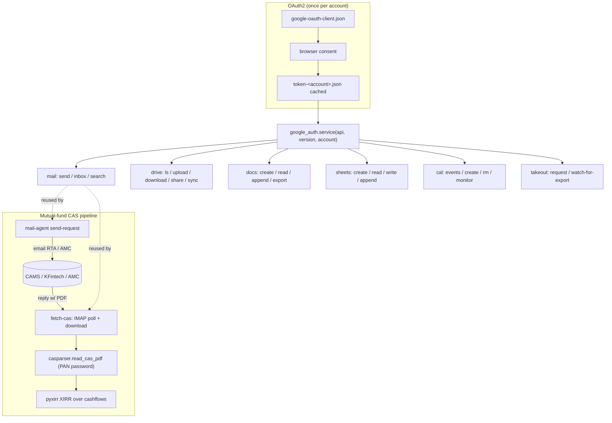

# life-cli

> A personal Google-Workspace / Gmail CLI — mail, Drive, Docs, Sheets, Calendar, Contacts, Takeout, plus a mutual-fund CAS document requester that emails RTAs/AMCs, parses the returned statement, and computes portfolio XIRR.

[](LICENSE)
[](https://github.com/chirag127/life-cli/stargazers)
[](https://github.com/chirag127/life-cli/commits)
[](https://python.org)

**GHP landing** https://chirag127.github.io/life-cli/ · **Repo** https://github.com/chirag127/life-cli

⭐ If this is useful, please star the repo — it helps others find it.

`life-cli` (PyPI package name `mail-agent`) is a thin, self-contained wrapper over the Google Workspace APIs. It authenticates once per account via OAuth2, then exposes mail/Drive/Docs/Sheets/Calendar/Contacts/Takeout as JSON-emitting subcommands. On top of that sits a mutual-fund workflow that requests a Consolidated Account Statement (CAS) from an RTA (CAMS/KFintech) or scheme literature from an AMC, polls the inbox for the reply, parses the CAS PDF with [casparser](https://github.com/codereverser/casparser), and computes portfolio XIRR with [pyxirr](https://github.com/Anexen/pyxirr).

Design principle: **minimum own code** — Google's client library does transport, `casparser` parses statements, `pyxirr` does the math.

## Flow



## Features

- **Multi-account OAuth2** — one token per named account, all scopes; select with `-A/--account` or `GOOGLE_ACCOUNT`. Token refresh is automatic.
- **Gmail** — send (with attachments), list inbox, search (Gmail query syntax), read full messages, download attachments.
- **Drive** — list/search, upload, download, delete, share, and `rclone`-backed sync.
- **Docs** — create, read, append text, export (PDF or any MIME).
- **Sheets** — create, read a range, write a range, append rows.
- **Calendar** — list/create/delete events, and a `monitor` mode that diffs against a saved snapshot (for change alerts).
- **Contacts** — People API access.
- **Takeout** — best-effort assist: prints the interactive Takeout steps, then polls Gmail for the "your data is ready" email and downloads Drive-delivered archives (direct download links are printed for the browser). Data Portability API stub included.
- **Mutual-fund CAS** — template-driven requests to RTAs/AMCs, IMAP polling for the reply, PDF parsing, and portfolio XIRR (pyxirr, with a Newton-method fallback).
- **Pure-Python** — no native binaries required (works on locked-down environments).

## Tech stack

| Area | Dependency |
|---|---|
| Google APIs | `google-api-python-client`, `google-auth`, `google-auth-oauthlib` |
| CAS parsing | `casparser` |
| Returns math | `pyxirr` |
| Config | `python-dotenv` |
| Microsoft (optional) | `msgraph-sdk`, `azure-identity` |
| Dev | `pytest` |
| Build | `hatchling` |

## Repo structure

```
life-cli/
├── pyproject.toml              # package "mail-agent"; entry points gtool/gsuite/mail-agent
├── SETUP.md                    # one-time OAuth credential setup (Google + Microsoft)
├── .env.example                # env-var names (copy to .env, git-ignored)
├── life_cli/
│   ├── gtool.py                # unified Workspace CLI — argparse dispatch, JSON to stdout
│   ├── request.py              # mail-agent: template render + send + fetch-cas
│   ├── google_auth.py          # one OAuth token per account, all scopes
│   ├── gmail_api.py            # Gmail send / inbox / search / read / attachments
│   ├── drive.py                # Drive files + rclone sync
│   ├── docs.py                 # Google Docs
│   ├── sheets.py               # Google Sheets
│   ├── calendar.py             # Calendar events
│   ├── calendar_monitor.py     # snapshot-diff change detection
│   ├── contacts.py             # People API
│   ├── cas.py                  # CAS parse + XIRR + request URLs
│   ├── takeout.py              # semi-automatic Takeout / Data Portability
│   ├── config.py               # .env loader
│   ├── templates/              # RTA folio-statement + AMC scheme-literature request bodies
│   ├── templates_loader.py     # template registry + render
│   ├── core/                   # provider abstraction (models, base)
│   └── providers/              # google / microsoft provider adapters
├── config/                     # OAuth client + cached tokens (git-ignored — NOT committed)
└── tests/                      # pytest (external calls mocked)
```

## Quick start

```bash
pip install -e .
```

Then do the one-time credential setup in [SETUP.md](SETUP.md): create a Google Cloud project, enable the Gmail/Drive/Docs/Sheets/Calendar APIs, configure the OAuth consent screen, download the desktop OAuth client JSON to `config/google-oauth-client.json`, and mint per-account tokens (first call opens a browser to consent).

```bash
# verify auth / list configured accounts
gtool -A why accounts list
```

## CLI reference

Three entry points are installed: `gtool` and `gsuite` (aliases for the unified Workspace CLI) and `mail-agent` (the template + CAS requester).

### `gtool` / `gsuite`

```bash
# mail
gtool mail send --to a@b.com --subject "Hi" --body "text" [--attach file]
gtool mail inbox [--mailbox INBOX] [-n 50]
gtool mail search "from:example.com is:unread" [-n 50]

# drive
gtool drive ls [-q QUERY] [-n 100]
gtool drive upload PATH [--folder ID] [--name NAME]
gtool drive download FILE_ID DEST
gtool drive share FILE_ID EMAIL [--role reader]
gtool drive rm FILE_ID
gtool drive sync SRC DST                 # via rclone

# docs
gtool docs create TITLE [--body TEXT]
gtool docs read DOC_ID
gtool docs append DOC_ID TEXT
gtool docs export DOC_ID DEST [--mime application/pdf]

# sheets
gtool sheets create TITLE
gtool sheets read SID RANGE
gtool sheets write SID RANGE cell1 cell2 '|' cell3   # '|' splits rows
gtool sheets append SID RANGE cell1 cell2

# calendar
gtool cal events [--calendar primary] [--from ISO] [--to ISO] [-n 50]
gtool cal create SUMMARY START END [--desc D] [--attendee EMAIL] [--calendar primary]
gtool cal rm EVENT_ID [--calendar primary]
gtool cal monitor SNAPSHOT.json          # diff vs previous run

# mutual-fund CAS (via Gmail)
gtool cas fetch OUT_DIR                   # find CAS email, download PDF

# accounts
gtool accounts list
gtool accounts clear [NAME]               # delete cached token (forces re-consent)
```

Global `-A/--account NAME` selects the OAuth token for any subcommand (default: `GOOGLE_ACCOUNT` env). All output is JSON to stdout.

### `mail-agent`

```bash
mail-agent list-templates                                    # RTA + AMC request templates
mail-agent send-request --key <template> --to <addr> --field name=value ...
mail-agent fetch-cas --out downloads/                        # find + download CAS PDF
mail-agent inbox
mail-agent search "<gmail query>"
```

Templates cover folio statements requested from RTAs (CAMS / KFintech) and scheme literature requested from AMCs (SID, KIM, SAI, factsheet, portfolio disclosure, TER, half-yearly, annual report, addenda). The CAS PDF password is your investor PAN in uppercase.

## Configuration

Copy `.env.example` to `.env` (git-ignored) and fill in real values. Env-var **names + purpose** only — never commit values.

| Variable | Purpose |
|---|---|
| `GOOGLE_ACCOUNTS` | comma-separated list of account names |
| `GOOGLE_ACCOUNT` | default account name when `-A` is omitted |
| `GOOGLE_ACCOUNT_<name>` | maps an account name to its Google email (login hint) |
| `GMAIL_USER` | your Gmail address |
| `GMAIL_APP_PASSWORD` | Gmail App Password (2FA required) — used only by non-API mail backends |
| `INVESTOR_PAN` | investor PAN (uppercase) — the CAS PDF password |
| `REGISTERED_EMAIL` | email registered with RTAs/AMCs for CAS delivery |
| `DOWNLOAD_DIR` | where downloaded attachments are saved |
| `IMAP_POLL_SECONDS` | poll interval when waiting for a reply |
| `IMAP_POLL_TIMEOUT` | give up after N seconds |
| `MICROSOFT_CLIENT_ID` | Azure app (client) ID for the optional Microsoft provider |
| `MICROSOFT_TENANT_ID` | Azure tenant (`common` for personal + work) |

## Security

- **No secrets in repo.** Credentials live outside the repo. The OAuth client JSON and cached per-account tokens under `config/`, and `.env`, are git-ignored and are never committed.
- The Gmail **App Password** (where used) lives in `.env` only — never the real account password.
- Downloaded CAS PDFs (which contain folio/PAN data) land in a git-ignored `downloads/` directory.
- Nothing sensitive is committed. The encrypted `.env.enc` (sops + age) is the only credential artifact that may be committed, and it is decrypted locally.

## Part of the oriz family

One of ~80 sites and tools in the oriz family. See [blog.oriz.in](https://blog.oriz.in).

## Contributing

Issues and PRs welcome. Keep changes minimal, prefer editing over adding, and never commit real credentials.

## Status

Active — used personally for Google Workspace automation and mutual-fund tracking.

## License

MIT © Chirag Singhal — chirag@oriz.in

Conventional commits are the changelog.
